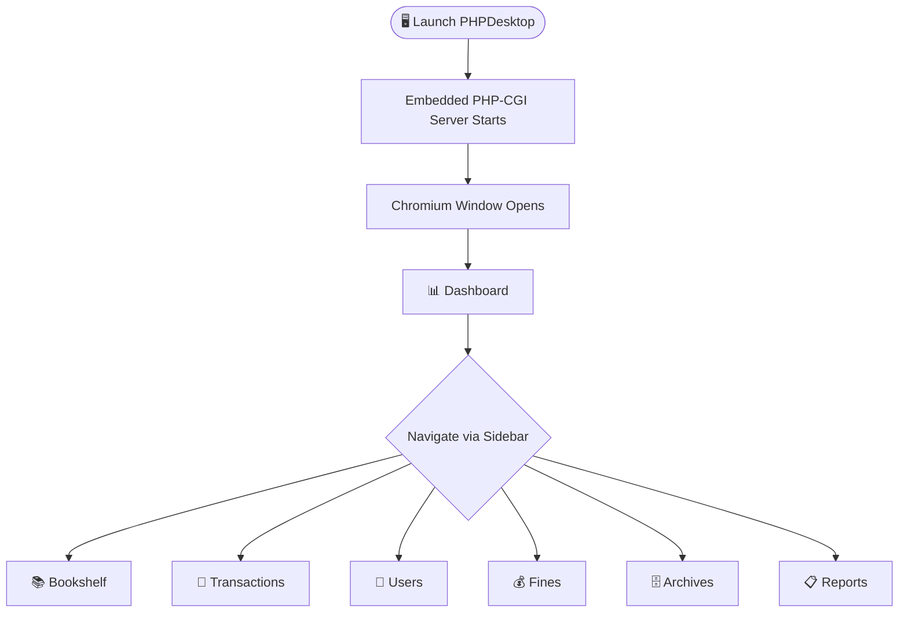
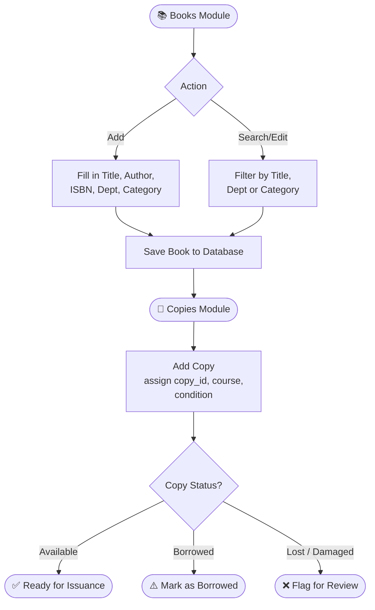
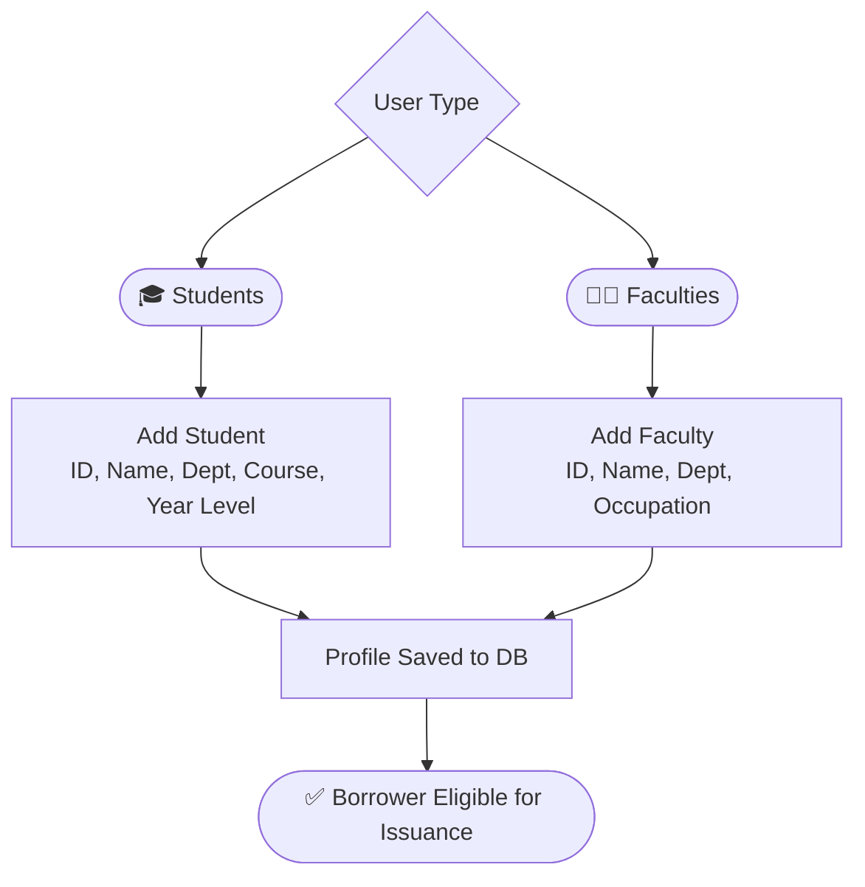
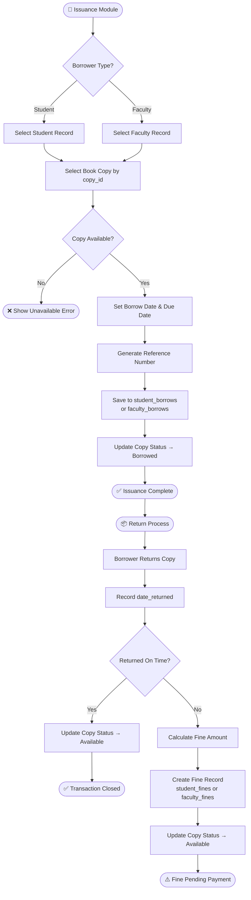
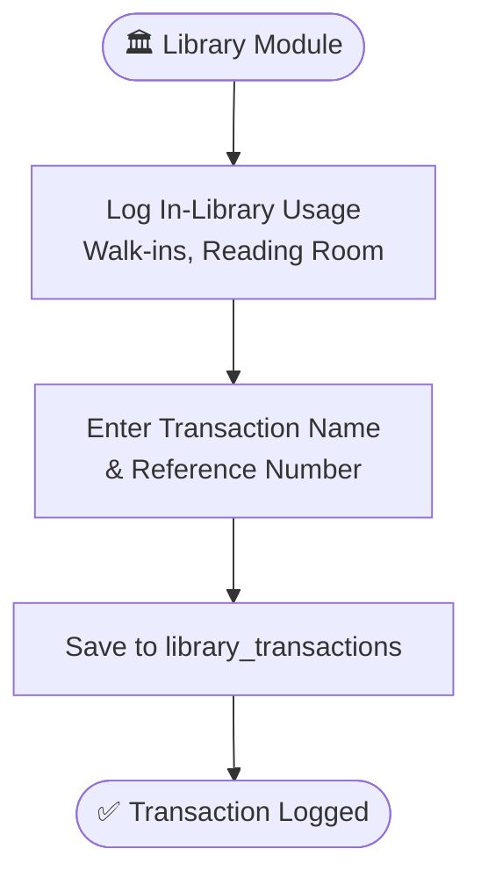
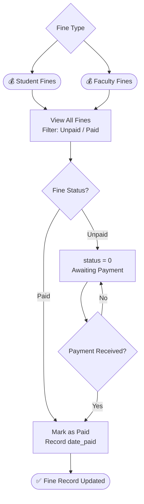
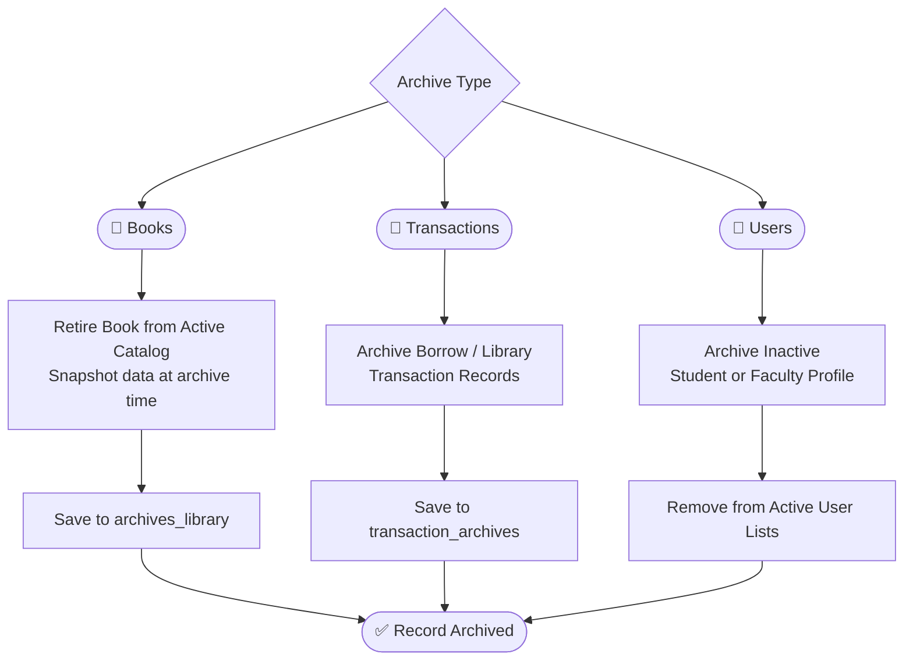
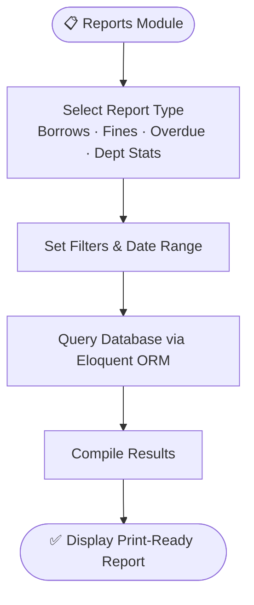

**[Home](README.md)** | **[Flowchart]**

# BCU Library Management System — Application Flowchart

> Renders in GitHub, GitLab, Obsidian, VS Code (with Mermaid extension), and most modern documentation platforms.

---

## System Launch

---

## 📚 Bookshelf — Books & Copies

---

## 👥 Users — Students & Faculties

---

## 🔄 Transactions — Issuance & Return

---

## 🏛️ Transactions — Library Usage

---

## 💰 Fines — Students & Faculties

---

## 🗄️ Archives

---

## 📋 Reports

---

## Technology Stack

| Layer | Technology |
|---|---|
| Language | PHP 8.2+ |
| Framework | Laravel 11 |
| Reactivity | Livewire 3 |
| UI Components | Flux UI |
| JS Interactivity | Alpine.js |
| Styling | Tailwind CSS |
| Asset Bundler | Vite |
| Database | SQLite |
| Desktop Runtime | PHPDesktop |

---

*Baguio Central University — Library Management System · February 2026*
